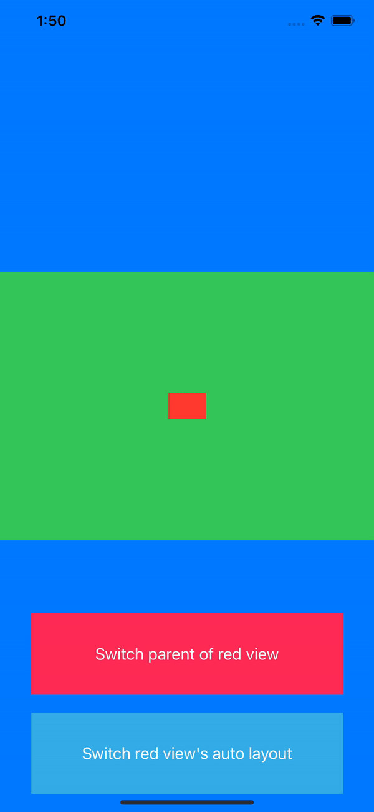

# snapkit-demo-swift
This project is to demonstrate how to use snapkit, a lightweight DSL (domain-specific language) to make Auto Layout and constraints easy.

  

# For details...
- [How to use SnapKit](https://jung-yun.github.io/snapkit-guide/)
